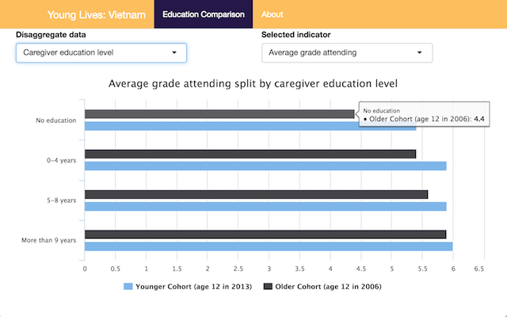

# Young Lives Shiny Apps

This repository contains Shiny apps designed for visualising educational outcomes for the University of Oxford's Young Lives project.

The academic contacts for this work are (Patricia Revolio)[http://orcid.org/0000-0002-1192-3885] and
(Paul Dornan)[http://orcid.org/0000-0003-2477-496X]

</img>

This code has been deposited on Figshare: http://doi.org/10.6084/m9.figshare.5554948